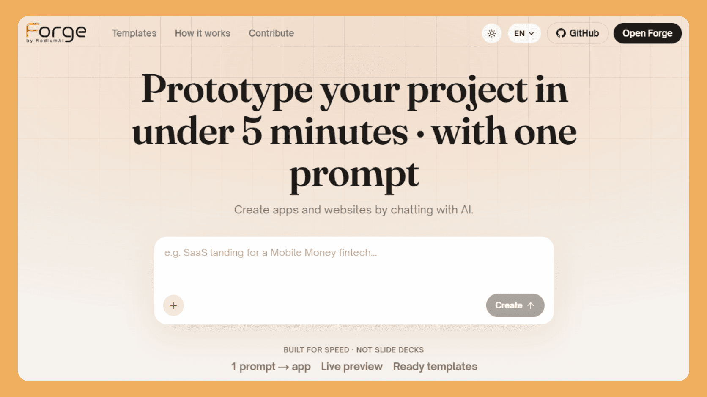
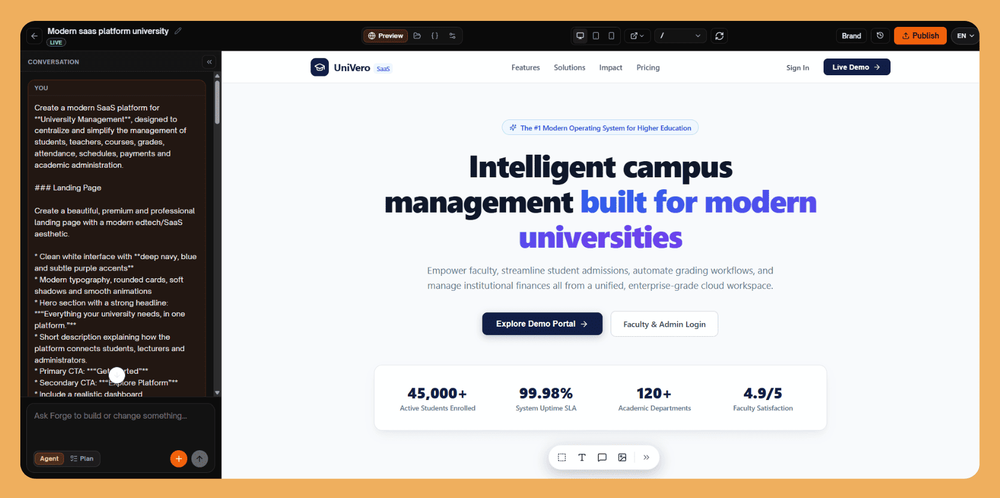

# Forge

<p align="center">
  
</p>

<p align="center">
  <a href="https://github.com/RodiumAi/Forge/actions/workflows/ci.yml"></a>
  
  
  
  
  
  
  <a href="LICENSE"></a>
</p>

> 🇬🇧 [English version](README.md)

Forge est un builder de sites web par IA, open source. Décrivez votre site dans un chat : l'agent génère une app React frontend-only, prévisualisée instantanément dans le navigateur — sans node_modules ni Vite — et publiée en site statique ESM.

## Architecture

```
forge-web/
├── apps/
│   ├── web/            # Next.js 15 + TypeScript — UI du builder
│   └── api/            # FastAPI + SQLAlchemy + Postgres — API, agent, orchestration
│       └── runtime/    # Runner Babel navigateur (JS pur) + manifest packages.json
├── data/
│   └── templates/      # 24 templates de départ (voir docs/TEMPLATES.md)
└── infra/              # Docker local + outils CI
```

Services d'appui : **MinIO** (uploads S3), **Valkey** (file de runs / annulation), **Caddy** (sites publiés sur `*.lvh.me:8080`), **Adminer** (console DB). Les appels LLM passent par le gateway **RodiumAI** (clé API fournie par l'utilisateur dans les réglages).

## Fonctionnalités clés

- **Du chat au site** : décrivez un site, l'agent génère une app React frontend-only.
- **Preview instantanée** : runner Babel/ESM dans le navigateur — transformation du code côté navigateur avec import map CDN (esm.sh). Ni node_modules, ni Vite.
- **Publication** : site statique ESM servi par Caddy.
- **Édition visuelle** : texte et images, directement sur la preview.
- **Historique / rollback** : snapshots git par projet.
- **Export ZIP** : un vrai projet Vite exécutable.
- **24 templates** : voir [docs/TEMPLATES.md](docs/TEMPLATES.md).
- **Manifest du runtime** : `packages.json` est la source unique de l'import map, de l'allowlist AST et des types Monaco.
- **Assets vs captures** : les logos vont dans `public/` ; les captures guident la mise en page (et les plans multi-pages). Collez une URL de site pour capturer automatiquement desktop/mobile (Playwright).

<p align="center">
  
</p>

## Prérequis

| Outil | Version | Nécessaire pour |
| --- | --- | --- |
| Docker + Compose v2 | version courante | le démarrage rapide ci-dessous |
| Node.js | **22** (`.nvmrc`) | lancer `apps/web` sur l'hôte |
| Python | **3.12** (`.python-version`) | lancer `apps/api` sur l'hôte |

La CI tourne exactement sur ces versions. Des runtimes plus anciens peuvent
compiler en local et échouer en CI — `ruff` cible `py312` et plusieurs
dépendances sont sensibles à la version.

> **La connexion dépend d'un service absent de ce dépôt.** L'authentification
> passe par le fournisseur OIDC RodiumAI : avec `RODIUM_OIDC_CLIENT_ID` vide
> (valeur par défaut), `GET /auth/rodium/start` renvoie `503`, et il n'existe
> aucun compte local de repli — `/auth/register` renvoie définitivement
> `410 Gone`. Vous pouvez lancer toute la stack, parcourir le code et travailler
> sur les templates, mais pas vous connecter au builder sans identifiants
> RodiumAI. Voir le [suivi des issues](https://github.com/RodiumAi/Forge/issues)
> si vous en avez besoin.

## Démarrage rapide (Docker)

```bash
cp .env.example .env
make up          # docker compose up -d --build, puis applique le schéma
```

Sans `make`, exécutez les deux étapes vous-même — un volume neuf n'a aucune
table tant que la seconde n'a pas tourné :

```bash
cp .env.example .env
docker compose up -d --build
docker compose exec -T api python -c "from app.db import init_db; init_db()"
```

| Service | URL |
| --- | --- |
| UI du builder | http://localhost:3100 |
| Docs API | http://localhost:8100/docs |
| Sites publiés | http://\<slug\>.lvh.me:8080 |
| Console MinIO | http://localhost:9001 |
| Adminer | http://localhost:8089 |

## Développement hybride (infra Docker + api/web en local)

Lancez l'infra avec Docker, puis l'API et/ou le web en local.

**API**

```bash
cd apps/api
python -m venv .venv && source .venv/bin/activate   # Windows : .venv\Scripts\activate
pip install -r requirements-dev.txt                 # deps runtime + ruff + pytest
cp .env.example .env
uvicorn app.main:app --reload --port 8100
```

**Web**

```bash
cd apps/web
npm install
npm run dev   # port 3100
```

## Tests et vérifications

Ce sont exactement les commandes de la CI : un run local vert signifie une CI verte.

```bash
# apps/web
npm run lint && npm run typecheck && npm test
FORGE_FONT_MODE=fallback npm run build

# apps/api  (TEMPLATES_ROOT doit pointer vers data/templates)
ruff check app tests && ruff format --check app tests
pytest -q

# apps/api/runtime
npm ci && npm test
```

## Variables d'environnement

Copiez `.env.example` vers `.env` et ajustez au besoin — il documente toutes les
variables essentielles (base de données, MinIO, Valkey, gateway RodiumAI, etc.).
`apps/api` et `apps/web` ont chacun leur propre `.env.example` pour le
développement sur l'hôte.

## Contribuer

Les contributions sont bienvenues. [CONTRIBUTING.fr.md](CONTRIBUTING.fr.md)
couvre le setup, les vérifications à lancer avant de pousser, le process de PR
et la soumission d'un kit template. Merci de lire aussi le
[Code de Conduite](CODE_OF_CONDUCT.fr.md).

En contribuant, vous acceptez que vos contributions soient placées sous la
licence MIT qui couvre ce projet.

## Documentation

- [docs/ARCHITECTURE.fr.md](docs/ARCHITECTURE.fr.md) — le fonctionnement réel d'un run, de la preview et de la publication
- [CONTRIBUTING.fr.md](CONTRIBUTING.fr.md) — setup dev, vérifications, guide PR, **kits templates**
- [docs/TEMPLATES.fr.md](docs/TEMPLATES.fr.md) — contrat complet de création de templates
- [DOCKER.fr.md](DOCKER.fr.md) — stack locale, ports, notes de preview
- [SECURITY.fr.md](SECURITY.fr.md) — signalement de vulnérabilités
- [CODE_OF_CONDUCT.fr.md](CODE_OF_CONDUCT.fr.md)
- [LICENSE](LICENSE) — MIT
