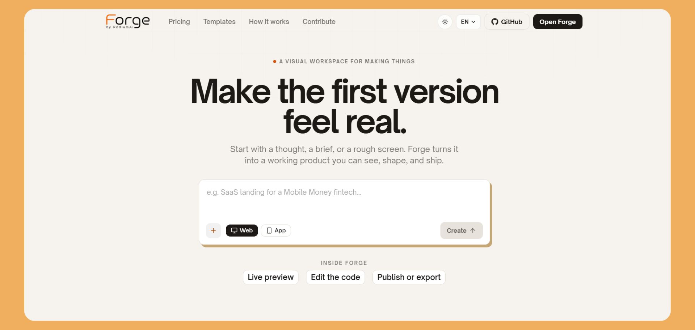
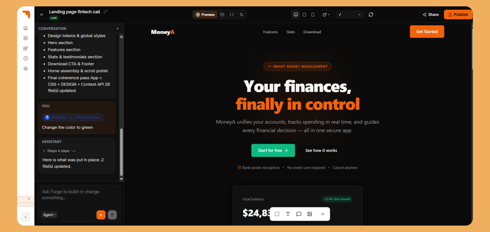
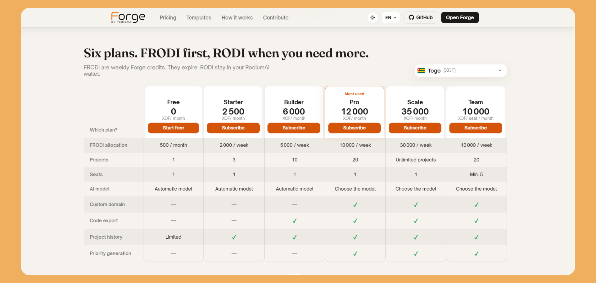

# Forge

<p align="center">
  
</p>

<p align="center">
  <a href="https://github.com/RodiumAi/Forge/actions/workflows/ci.yml"></a>
  
  
  
  
  
  
  <a href="LICENSE"></a>
</p>

> 🇬🇧 [English version](README.md)

Forge est un builder de sites et d'apps par IA, open source. Décrivez ce que vous voulez dans un chat : l'agent génère une app React frontend-only, prévisualisée instantanément dans le navigateur — sans node_modules ni Vite — et publiée en site statique ESM.

## Deux modes

| | **Self-host (ce dépôt)** | **Forge Cloud** ([forge.rodiumai.io](https://forge.rodiumai.io)) |
| --- | --- | --- |
| **Comptes** | Email/mot de passe local (+ Google optionnel) | SSO RodiumAi (OIDC) |
| **Crédits** | Collez votre clé API RodiumAi (`rd_sk_…`) | **FRODI** d'abord (quota plan), **RODI** en secours |
| **Offre Free** | Apportez votre clé | **500 FRODI / mois** sur Free |
| **Plans / facturation** | N/A en OSS | Free → Starter → Builder → Pro → Scale → Team (voir ci-dessous) |

Le self-host ne dépend d'aucun service que vous ne pouvez pas lancer. Les droits Cloud et les grants de plan vivent dans Nest ; ce dépôt les consomme via `/auth/forge/status` et `internal/forge/balance`.

## Architecture

```
forge-web/
├── apps/
│   ├── web/            # Next.js 15 + TypeScript — UI du builder
│   └── api/            # FastAPI + SQLAlchemy + Postgres — API, agent, orchestration
│       └── runtime/    # Runner Babel navigateur (JS pur) + manifest packages.json
├── data/
│   ├── templates/      # 36 kits de départ — Web + Appli (voir docs/TEMPLATES.md)
│   └── integrations/   # Catalogue d'embeds (voir docs/INTEGRATIONS.md)
└── infra/              # Docker local + outils CI
```

Services d'appui : **MinIO** (uploads S3), **Valkey** (file de runs / annulation), **Caddy** (sites publiés sur `*.lvh.me:8080`), **Adminer** (console DB). Les appels LLM passent par le gateway **RodiumAI**.

## Fonctionnalités clés

- **Du chat au site** : décrivez un site ou une app ; l'agent génère un projet React frontend-only.
- **Web vs Appli** : kits galerie pour sites marketing et coques style mobile.
- **Preview instantanée** : runner Babel/ESM dans le navigateur — import map CDN (esm.sh). Ni node_modules, ni Vite.
- **Publication** : build de production (bundlé, minifié, hashé, dépendances embarquées), chaque route pré-rendue avec son titre et ses metas, `404.html`, sitemap, robots, données structurées et en-têtes de cache, servi par Caddy.
- **Charte de marque au premier build** : palette, paire Google Fonts et direction d'images tirées du brief, plus les premières images générées (WebP + srcset).
- **Édition visuelle** : texte et images, directement sur la preview.
- **Historique / rollback** : snapshots git par projet.
- **Export ZIP** : un vrai projet Vite exécutable.
- **36 templates** : voir [docs/TEMPLATES.md](docs/TEMPLATES.md).
- **Catalogue d'intégrations** : embeds prêts à coller — [docs/INTEGRATIONS.md](docs/INTEGRATIONS.md).
- **Badge FRODI (Cloud)** : plan + quota dans la sidebar ; RODI quand les FRODI sont épuisés ou absents.
- **Manifest du runtime** : `packages.json` est la source unique de l'import map, de l'allowlist AST et des types Monaco.
- **Assets vs captures** : les logos vont dans `public/` ; les captures guident la mise en page. Collez une URL pour capturer desktop/mobile (Playwright).

<p align="center">
  
</p>

## Plans (Forge Cloud)

Six plans. **FRODI d'abord**, RODI quand il en faut plus. Les FRODI sont des crédits Forge (hebdo sur les plans payants, mensuels sur Free) et expirent ; les RODI restent dans le wallet RodiumAi.

<p align="center">
  
</p>

| Plan | Cadence | Quota typique |
| --- | --- | --- |
| Free | mensuel | 500 FRODI |
| Starter / Builder / Pro / Scale | hebdomadaire | 2k → 30k FRODI |
| Team | hebdo / siège | à partir de 5 sièges |

Le catalogue et les grants sont gérés côté Nest admin ; le builder affiche les entitlements et les consomme.

## Prérequis

| Outil | Version | Nécessaire pour |
| --- | --- | --- |
| Docker + Compose v2 | version courante | le démarrage rapide ci-dessous |
| Node.js | **22** (`.nvmrc`) | lancer `apps/web` sur l'hôte |
| Python | **3.12** (`.python-version`) | lancer `apps/api` sur l'hôte |

La CI tourne exactement sur ces versions. Des runtimes plus anciens peuvent
compiler en local et échouer en CI — `ruff` cible `py312` et plusieurs
dépendances sont sensibles à la version.

> **En self-host, la connexion fonctionne immédiatement.** Créez un compte
> local sur `/register` (email/mot de passe). Google est optionnel (Firebase).
> **"Continuer avec RodiumAI"** n'apparaît que si `RODIUM_OIDC_CLIENT_ID` est
> renseigné ; sinon le bouton reste masqué. Sur Forge Cloud, le SSO OIDC est
> le chemin principal et Free+500 FRODI est accordé depuis Nest.

## Démarrage rapide (Docker)

```bash
cp .env.example .env
make up          # docker compose up -d --build, puis applique le schéma
```

Sans `make`, exécutez les deux étapes vous-même — un volume neuf n'a aucune
table tant que la seconde n'a pas tourné :

```bash
cp .env.example .env
docker compose up -d --build
docker compose exec -T api python -c "from app.db import init_db; init_db()"
```

| Service | URL |
| --- | --- |
| UI du builder | http://localhost:3100 |
| Docs API | http://localhost:8100/docs |
| Sites publiés | http://\<slug\>.lvh.me:8080 |
| Console MinIO | http://localhost:9001 |
| Adminer | http://localhost:8089 |
| Mail (Mailpit) | http://localhost:8026 |

## Première utilisation : compte et clé de génération

**1. Créez un compte.** Ouvrez http://localhost:3100/register et inscrivez-vous.
Vous êtes connecté immédiatement.

**2. Confirmez votre e-mail.** La stack embarque Mailpit : le mail est réel,
mais ne quitte pas votre machine. Ouvrez **http://localhost:8026** — le message
de confirmation y attend, lien inclus. La réinitialisation de mot de passe
fonctionne de la même façon.

API sur l'hôte plutôt qu'en Docker ? `mailpit` ne résout pas : mettez
`MAIL_TRANSPORT=console` et les liens s'affichent dans les logs API. Pour une
vraie livraison : `MAIL_TRANSPORT=ses` (+ credentials `AWS_*`).

**3. Ajoutez une clé de génération (self-host).** Forge n'embarque pas de
modèle — vous apportez les credentials. Créez un compte gratuit sur
[rodiumai.io](https://rodiumai.io), copiez une clé API (`rd_sk_prod_…`), et
collez-la dans Forge sous **Réglages → Génération**. Le bouton **Tester**
confirme la clé.

Sur **Forge Cloud**, les comptes liés utilisent les entitlements Nest (FRODI)
plutôt qu'une clé collée ; la sidebar affiche le solde du plan.

`RODIUM_BASE_URL` doit correspondre à l'endroit où la clé est valide. La valeur
par défaut `https://api.rodiumai.io/v1` convient pour une clé rodiumai.io.

Google est optionnel : renseignez `FIREBASE_*` (API) et `NEXT_PUBLIC_FIREBASE_*`
(web) pour afficher le bouton Google. Laissez-les vides et le bouton n'est pas
rendu. Réutilisez la même app Firebase que le dashboard RodiumAI ; activez
**Google** dans la console Firebase et ajoutez `forge.rodiumai.io` aux domaines
autorisés. GitHub n'est pas proposé dans l'UI Forge.

## Développement hybride (infra Docker + api/web en local)

Lancez l'infra avec Docker, puis l'API et/ou le web en local.

**API**

```bash
cd apps/api
python -m venv .venv && source .venv/bin/activate   # Windows : .venv\Scripts\activate
pip install --require-hashes -r requirements-dev.txt # deps runtime + ruff + pytest
cp .env.example .env
uvicorn app.main:app --reload --port 8100
```

**Web**

```bash
cd apps/web
npm install
npm run dev   # port 3100
```

## Tests et vérifications

Ce sont exactement les commandes de la CI : un run local vert signifie une CI verte.

```bash
# apps/web
npm run lint && npm run typecheck && npm test
FORGE_FONT_MODE=fallback npm run build

# apps/api  (TEMPLATES_ROOT → data/templates, INTEGRATIONS_ROOT → data/integrations ; voir CONTRIBUTING)
ruff check app tests && ruff format --check app tests
pytest -q

# apps/api/runtime
npm ci && npm test
```

## Variables d'environnement

Copiez `.env.example` vers `.env` et ajustez au besoin — il documente toutes les
variables essentielles (base de données, MinIO, Valkey, gateway RodiumAI, OIDC,
etc.). `apps/api` et `apps/web` ont chacun leur propre `.env.example` pour le
développement sur l'hôte.

## Contribuer

Les contributions sont bienvenues. [CONTRIBUTING.fr.md](CONTRIBUTING.fr.md)
couvre le setup, les vérifications à lancer avant de pousser, le process de PR
et la soumission d'un kit template ou d'intégration. Merci de lire aussi le
[Code de Conduite](CODE_OF_CONDUCT.fr.md).

En contribuant, vous acceptez que vos contributions soient placées sous la
licence MIT qui couvre ce projet.

## Documentation

- [docs/ARCHITECTURE.fr.md](docs/ARCHITECTURE.fr.md) — le fonctionnement réel d'un run, de la preview et de la publication
- [CONTRIBUTING.fr.md](CONTRIBUTING.fr.md) — setup dev, vérifications, guide PR, **templates** & **intégrations**
- [docs/TEMPLATES.fr.md](docs/TEMPLATES.fr.md) — contrat complet de création de templates
- [docs/INTEGRATIONS.fr.md](docs/INTEGRATIONS.fr.md) — contrat du catalogue d'embeds
- [docs/OPEN_PR_TRIAGE.md](docs/OPEN_PR_TRIAGE.md) — triage maintainer des PR ouvertes (EN)
- [DOCKER.fr.md](DOCKER.fr.md) — stack locale, ports, notes de preview
- [SECURITY.fr.md](SECURITY.fr.md) — signalement de vulnérabilités
- [CODE_OF_CONDUCT.fr.md](CODE_OF_CONDUCT.fr.md)
- [LICENSE](LICENSE) — MIT
