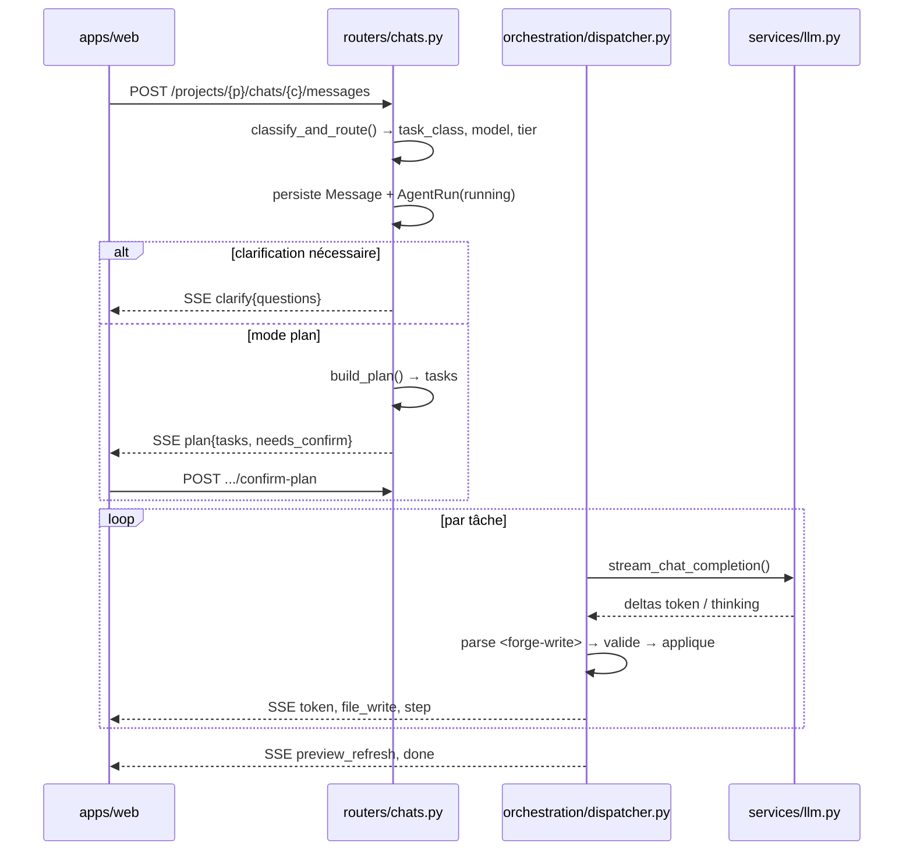

> 🇬🇧 [English version](ARCHITECTURE.md)

# Architecture

Comment Forge transforme un message de chat en application React fonctionnelle,
et où vit chaque pièce. Écrit pour les contributeurs — chaque affirmation
ci-dessous pointe vers un fichier que vous pouvez ouvrir.

## En bref

```
apps/web      Next.js 15 App Router — UI du builder, consommateur SSE
apps/api      FastAPI — routage, orchestration de l'agent, publication
  runtime/    Chaîne Babel/ESM Node + navigateur (partagée preview ET publication)
data/         templates/ (24 kits de départ) · projects/ (workspaces générés)
infra/        stack Docker locale · helpers CI · sites gateway AWS
```

Services d'appui : **Postgres**, **MinIO** (S3), **Valkey** (Redis), **Caddy**
(sert les sites publiés). Les appels LLM sortent vers le gateway RodiumAI.

Trois idées expliquent l'essentiel de la conception :

1. **Jamais d'étape de build.** Les projets générés ne sont jamais compilés
   côté serveur. Le navigateur les transforme avec Babel standalone et charge
   les dépendances depuis une import map CDN. Ni `node_modules`, ni serveur de
   développement Vite.
2. **Un manifeste, deux consommateurs.** `apps/api/runtime/packages.json` est
   l'unique source de vérité pour l'import map, la liste blanche d'imports et
   les types Monaco. Preview et publication lisent le *même* fichier via le
   *même* resolver.
3. **L'API ne détient aucun identifiant LLM.** Sur le chemin actuel, Forge
   envoie le jeton d'accès OAuth de l'utilisateur et un **id** de clé API — le
   secret de la clé n'atteint jamais ce code.

## Un run de génération, de bout en bout



**Points d'entrée.** L'UI poste depuis `apps/web/app/projects/[id]/page.tsx` et
replie chaque événement via `apps/web/lib/chat-stream.ts` (`reduceStreamEvent`
renvoie `{state, effects}` ; la page exécute les effets). Côté serveur,
`apps/api/app/routers/chats.py` (`send_message`) choisit l'une des quatre
branches — image, clarify, passe unique, ou plan.

**Streaming.** Tout passe en SSE, enveloppé par `with_sse_heartbeats`
(`apps/api/app/services/sse.py`) qui émet des commentaires `: hb <ts>` pour
qu'un run silencieux ne soit pas coupé par un proxy. Portez
`ALB_IDLE_TIMEOUT_SECONDS` (600 par défaut) au niveau de votre load balancer.

**Contrat d'événements** — chaque trame est `data: <json>` :

| `type` | Signification |
|---|---|
| `user_message` | poignée de main sur l'id du run |
| `route` | décision de routage (classe de tâche, palier) |
| `step`, `plan`, `plan_task` | panneau d'activité et checklist du plan |
| `token`, `thinking` | deltas de texte / de raisonnement |
| `clarify` | point d'arrêt humain ; libère le composer |
| `file_write`, `file_delete` | une opération a été appliquée |
| `preview_refresh` | émis aux frontières de tâches, pas à chaque écriture |
| `warning` | remontée du validateur ou de la vérification |
| `error`, `done` | terminal |

**Les reconnexions sont un cas de première classe.** Un run est produit par une
tâche de fond, pas par le handler HTTP — fermer l'onglet ne le tue pas.
`GET .../runs/active` restaure l'état, `GET .../runs/{id}/events?after=N`
rejoue puis suit.

**L'appel LLM** est du `httpx` brut vers un `/chat/completions` compatible
OpenAI — aucun SDK fournisseur. Voir `apps/api/app/services/llm.py`.

## La boucle de l'agent

**Forge n'utilise pas le function calling.** Le modèle écrit des balises XML
dans sa sortie normale et le serveur les analyse (`apps/api/app/prompts/system.py`
définit le contrat, `apps/api/app/services/tags.py` l'analyse) :

```
<forge-write path="src/App.tsx"> …contenu du fichier… </forge-write>
<forge-delete path="src/Old.tsx"></forge-delete>
```

Conséquence à connaître : **l'agent ne choisit pas les fichiers qu'il lit.** La
constitution du contexte est heuristique — `services/orchestration/context.py`
sélectionne par pertinence, chemins forcés et `files` déclarés par le plan, puis
superpose le prompt système, `AI_RULES.md`, un `DESIGN.md` verrouillé, les
squelettes de fichiers et les corps sélectionnés. L'historique ancien est
compacté par une passe LLM.

Phases : classification → clarification éventuelle → plan → exécution →
vérification/réparation. Les plans de quatre tâches ou plus, et tout scaffold,
s'arrêtent pour confirmation.

**Les écritures sont validées avant que quoi que ce soit touche le disque**
(`apps/api/app/services/apply_writes.py`) :

- Un **snapshot git** est pris d'abord — chaque projet est son propre dépôt
  privé sous `data/projects/{id}`, ce qui alimente l'historique et le rollback.
- Les imports sont vérifiés contre la liste blanche du manifeste via
  **tree-sitter** (`services/import_validator.py`), avec repli sur des regex.
  Violations : `BUILD_FORBIDDEN_IMPORT`, `BUILD_INVALID_NAMED_EXPORT`.
- `DESIGN.md` et `public/logo.*` sont verrouillés et rejetés par défaut.
- Le CSS est **fusionné, pas remplacé** : les blocs de premier niveau dont les
  sélecteurs ont disparu sont réajoutés, pour qu'une réécriture partielle ne
  puisse pas supprimer des styles en silence.

## Preview

Aucun serveur de développement n'est démarré. `GET /runner/` rend une coquille
(`apps/api/app/services/preview_babel.py`) qui injecte l'import map, les origines
parentes autorisées et Babel standalone. L'UI récupère ensuite le bundle source
et poste `{type:"forge:render", files, entry}` dans l'iframe.

Dans l'iframe (`apps/api/runtime/`) :

1. `transform.mjs` — Babel avec les presets React (runtime automatique) + TypeScript.
2. Les specifiers nus sont vérifiés contre l'import map du document → `IMPORT_NOT_IN_MANIFEST`.
3. `topo.mjs` — tri topologique, levant `CIRCULAR_DEPENDENCY` avec le cycle.
4. `rewrite.mjs` + `resolve.mjs` — chaque specifier est réécrit vers l'URL `blob:` déjà créée de sa dépendance. La résolution est **sensible à la casse** et comprend `@/` → `src/`.
5. `await import(entryBlobUrl)`. Les anciens blobs sont révoqués en cas de succès, conservés en cas d'échec pour que l'erreur reste inspectable.

L'import map n'est pas modifiable après chargement : c'est pourquoi les
dépendances propres au projet doivent être injectées au rendu de la coquille
(`?p=<uuid>`).

**L'épinglage d'origine est strict dans les deux sens.**
`RUNNER_PARENT_ORIGINS` construit une liste blanche ; le runner refuse d'émettre
ailleurs. Le code note que cela a été durci après qu'accepter n'importe quel port
localhost eut permis à une page locale malveillante de lire le contenu de l'app.

## Publication

`POST /projects/{id}/publish` → `apps/api/app/services/publish_esm.py` :

1. Lance `node apps/api/runtime/cli.mjs`, en passant le projet sur **stdin**.
2. `cli.mjs` réutilise *le même* transform Babel et *le même* resolver que la
   preview, mais `rewrite.mjs` émet des **chemins `.js` relatifs** au lieu
   d'URLs blob. Il écrit un `index.html` statique avec l'import map inline, tout
   le CSS dans un seul `<style>` (`src/index.css` en premier — exactement comme
   la preview), et un script module.
3. `public/` est copié tel quel ; tout est téléversé sous `{slug}/`.

Caddy est un **pur reverse proxy vers le bucket** — aucune application
d'origine. Il extrait le slug de l'en-tête Host et réécrit vers la clé du
bucket, avec repli SPA sur `{slug}/index.html`.

`/v1/authorize-host` n'existe **que pour les domaines custom** : le
`forward_auth` de Caddy demande à l'API si un hostname correspond à un
`ProjectDomain` validé, et récupère le slug de réécriture. Le slug reste
toujours la clé S3 — un domaine custom change le routage, jamais le stockage.

## Modèle de données

`apps/api/app/models.py`, SQLAlchemy 2.0 sur Postgres. La chaîne centrale est
`User → Project → Chat → Message`, avec `AgentRun` qui enregistre chaque
génération (statut, plan, réponses de clarification, et `cursor_task_index` pour
la reprise). `UserSettings` contient les jetons RodiumAI chiffrés.
`ProjectDomain`, `StoredObject`, `SiteUsageDay`, `PreviewComment` et
`ModelCatalog` complètent l'ensemble.

**Il n'y a pas d'Alembic.** `apps/api/app/db.py` exécute `create_all()` suivi
d'une liste d'instructions idempotentes écrites à la main
(`ADD COLUMN IF NOT EXISTS`, …), lancée depuis le lifespan FastAPI et depuis
`make migrate`. Il n'existe **aucun chemin de rollback ni table de version** —
ajoutez vos changements de schéma comme nouvelles instructions idempotentes, et
prévoyez de gérer les backfills vous-même.

## Authentification

Deux couches indépendantes :

- **La session Forge** — un JWT HS256 sur `SECRET_KEY`, 7 jours, émis par
  `POST /auth/rodium/callback`. `get_current_user` l'accepte en en-tête Bearer
  *ou* en paramètre `?access_token=`, délibérément, pour que les ``
  fonctionnent.
- **Les jetons OIDC RodiumAI** — obtenus par un flux authorization code + PKCE
  (`apps/api/app/services/rodium_oidc.py`). Le `state` OAuth est lui-même un JWT
  signé portant le verifier PKCE, ce qui évite tout stockage de session serveur.
  Les jetons sont chiffrés (Fernet) dans `user_settings`.

`resolve_generation_auth` (`services/rodium_generation.py`) s'exécute en tête de
chaque endpoint de génération. Sur le chemin actuel, il envoie le jeton d'accès
et un **id** de clé API — **le secret de la clé n'atteint jamais Forge.**

> La connexion exige le fournisseur OIDC RodiumAI, **absent de ce dépôt**. Sans
> `RODIUM_OIDC_CLIENT_ID`, `/auth/rodium/start` renvoie 503 et il n'existe aucun
> repli local : `/auth/register` renvoie définitivement `410 Gone`.

## Travail de fond

**Tout tourne dans le process de l'API.** `spawn_plan_job` crée une
`asyncio.Task` ; le handler HTTP ne fait que relayer depuis un tampon. Il n'y a
aucun conteneur worker, et `docker-compose.yml` n'en définit aucun.

Valkey/Redis sert au journal d'événements du run (TTL 24 h, tampon de rejeu
durable), à une clé de claim et à un drapeau d'annulation. **C'est optionnel** :
chaque helper se rabat sur un miroir en mémoire si Redis est injoignable, parce
qu'un Valkey éteint produisait auparavant un spinner infini silencieux.

## Aspérités à connaître

Notes honnêtes pour qui lit le code et s'interroge :

- `forge:plan:queue` est alimentée mais **jamais dépilée** — un jalon pour un
  worker futur qui n'existe pas encore.
- `providers/keys.py` et `providers/secrets.py` sont complets mais semblent
  **sans importateur** ; le chiffrement réellement utilisé est Fernet dans
  `app/crypto.py`. La config de production impose pourtant KMS/Secrets Manager.
- `providers/queue.py` définit une file d'usage Redis Streams complète que rien
  n'alimente ni ne consomme ; `SiteUsageDay` est écrit en synchrone à la place.
- `Project.preview_port` / `preview_running` sont des vestiges de l'époque du
  serveur de développement Vite.
- `apps/web/lib/preview-host.ts` réécrit vers `/preview-by-slug/{slug}`, pour
  lequel **aucune route FastAPI n'existe** — en local, Caddy sert ces hôtes
  depuis MinIO. Cela ressemble à un reliquat de l'architecture pré-Caddy.

## Pour aller plus loin

- [CONTRIBUTING.fr.md](../CONTRIBUTING.fr.md) — setup, vérifications, process de PR
- [TEMPLATES.fr.md](TEMPLATES.fr.md) — contrat de création de kits templates
- [DOCKER.fr.md](../DOCKER.fr.md) — stack locale, ports, notes de preview
