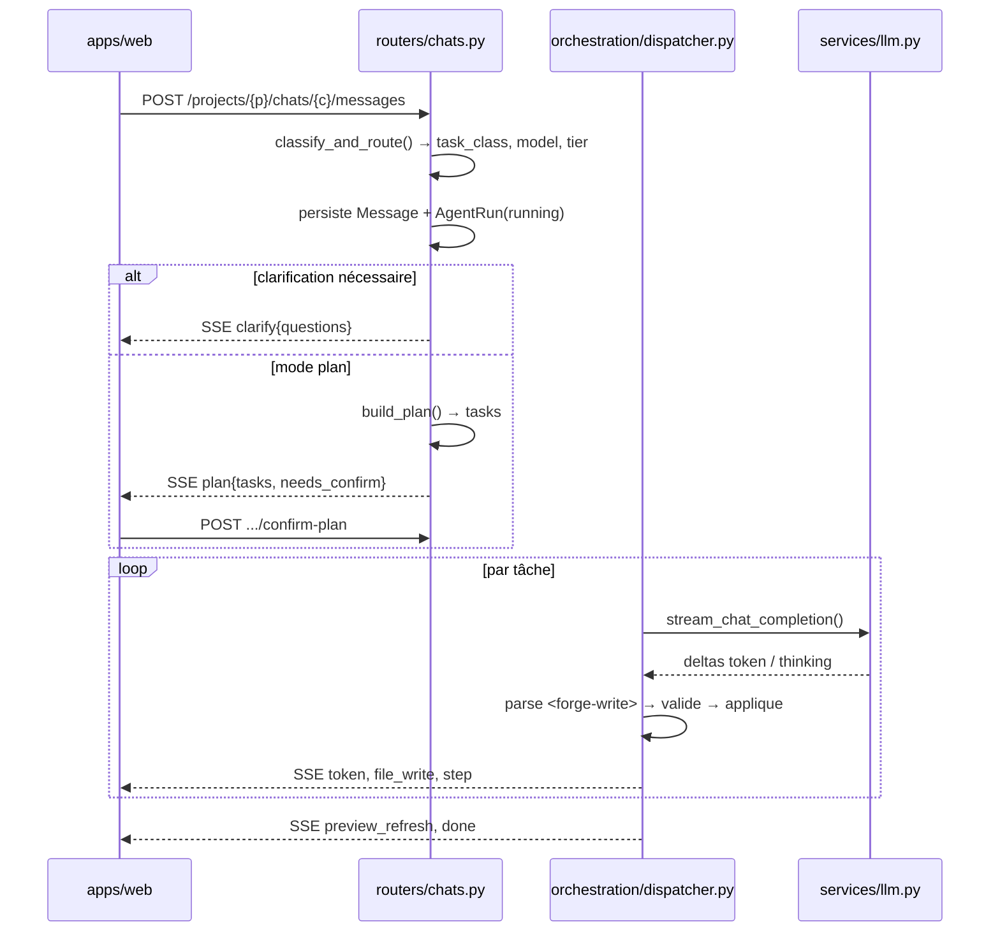

> 🇬🇧 [English version](ARCHITECTURE.md)

# Architecture

Comment Forge transforme un message de chat en application React fonctionnelle,
et où vit chaque pièce. Écrit pour les contributeurs — chaque affirmation
ci-dessous pointe vers un fichier que vous pouvez ouvrir.

## En bref

```
apps/web      Next.js 15 App Router — UI du builder, consommateur SSE
apps/api      FastAPI — routage, orchestration de l'agent, publication
  runtime/    Chaîne Babel/ESM Node + navigateur (partagée preview ET publication)
data/         templates/ (36 kits de départ) · integrations/ · projects/ (workspaces générés)
infra/        stack Docker locale · helpers CI · sites gateway AWS
```

Services d'appui : **Postgres**, **MinIO** (S3), **Valkey** (Redis), **Caddy**
(sert les sites publiés). Les appels LLM sortent vers le gateway RodiumAI.

Trois idées expliquent l'essentiel de la conception :

1. **Jamais d'étape de build.** Les projets générés ne sont jamais compilés
   côté serveur. Le navigateur les transforme avec Babel standalone et charge
   les dépendances depuis une import map CDN. Ni `node_modules`, ni serveur de
   développement Vite.
2. **Un manifeste, deux consommateurs.** `apps/api/runtime/packages.json` est
   l'unique source de vérité pour l'import map, la liste blanche d'imports et
   les types Monaco. Preview et publication lisent le *même* fichier via le
   *même* resolver.
3. **Aucun secret LLM dans le dépôt.** Sur Forge Cloud, la génération utilise le
   jeton OAuth de l'utilisateur et un **id** de clé API — le secret n'atteint
   jamais ce code. En self-host, on colle une clé BYOK `rd_sk_…` (chiffrée au
   repos) ; Cloud dépense d'abord les **FRODI**, puis les **RODI**.

## Un run de génération, de bout en bout


```mermaid
sequenceDiagram
  participant UI as apps/web
  participant API as routers/chats.py
  participant D as orchestration/dispatcher.py
  participant LLM as services/llm.py
  UI->>API: POST /projects/{p}/chats/{c}/messages
  API->>API: classify_and_route() → task_class, model, tier
  API->>API: persiste Message + AgentRun(running)
  alt clarification nécessaire
    API-->>UI: SSE clarify{questions}
  else mode plan
    API->>API: build_plan() → tasks
    API-->>UI: SSE plan{tasks, needs_confirm}
    UI->>API: POST .../confirm-plan
  end
  loop par tâche
    D->>LLM: stream_chat_completion()
    LLM-->>D: deltas token / thinking
    D->>D: parse <forge-write> → valide → applique
    D-->>UI: SSE token, file_write, step
  end
  D-->>UI: SSE preview_refresh, done
```

**Points d'entrée.** L'UI poste depuis `apps/web/app/projects/[id]/page.tsx` et
replie chaque événement via `apps/web/lib/chat-stream.ts` (`reduceStreamEvent`
renvoie `{state, effects}` ; la page exécute les effets). Côté serveur,
`apps/api/app/routers/chats.py` (`send_message`) choisit l'une des quatre
branches — image, clarify, passe unique, ou plan.

**Streaming.** Tout passe en SSE, enveloppé par `with_sse_heartbeats`
(`apps/api/app/services/sse.py`) qui émet des commentaires `: hb <ts>` pour
qu'un run silencieux ne soit pas coupé par un proxy. Portez
`ALB_IDLE_TIMEOUT_SECONDS` (600 par défaut) au niveau de votre load balancer.

**Contrat d'événements** — chaque trame est `data: <json>` :

| `type` | Signification |
|---|---|
| `user_message` | poignée de main sur l'id du run |
| `route` | décision de routage (classe de tâche, palier) |
| `step`, `plan`, `plan_task` | panneau d'activité et checklist du plan |
| `token`, `thinking` | deltas de texte / de raisonnement |
| `clarify` | point d'arrêt humain ; libère le composer |
| `file_write`, `file_delete` | une opération a été appliquée |
| `preview_refresh` | émis aux frontières de tâches, pas à chaque écriture |
| `warning` | remontée du validateur ou de la vérification |
| `error`, `done` | terminal |

**Les reconnexions sont un cas de première classe.** Un run est produit par une
tâche de fond, pas par le handler HTTP — fermer l'onglet ne le tue pas.
`GET .../runs/active` restaure l'état, `GET .../runs/{id}/events?after=N`
rejoue puis suit.

**L'appel LLM** est du `httpx` brut vers un `/chat/completions` compatible
OpenAI — aucun SDK fournisseur. Voir `apps/api/app/services/llm.py`.

## La boucle de l'agent

**Forge n'utilise pas le function calling.** Le modèle écrit des balises XML
dans sa sortie normale et le serveur les analyse (`apps/api/app/prompts/system.py`
définit le contrat, `apps/api/app/services/tags.py` l'analyse) :

```
<forge-write path="src/App.tsx"> …contenu du fichier… </forge-write>
<forge-edit path="src/App.tsx">
<<<<<<< SEARCH
lignes actuelles exactes
=======
lignes de remplacement
>>>>>>> REPLACE
</forge-edit>
<forge-delete path="src/Old.tsx"></forge-delete>
```

`forge-edit` applique des blocs chercher/remplacer au fichier courant
(`services/edit_apply.py` : correspondance exacte, puis ligne à ligne tolérante
aux espaces, jamais ambiguë) ; une modification qui ne s'applique pas a droit à
une relance ciblée avec le fichier montré en entier.

**Limites de sortie.** Chaque flux de code envoie `max_tokens` (sinon la
passerelle plafonne Claude/Gemini à 4096 tokens) et lit `finish_reason`. Une
réponse coupée par la limite, ou une balise restée ouverte, est poursuivie
(`stream_with_continuation` dans `services/llm.py`) : le fichier réémis remplace
la version coupée, et un fichier encore coupé après le dernier tour est signalé
à l'utilisateur au lieu de disparaître.

Conséquence à connaître : **l'agent ne choisit pas les fichiers qu'il lit.** La
constitution du contexte est heuristique : `services/orchestration/context.py`
sélectionne par pertinence, chemins forcés et `files` déclarés par le plan (les
dossiers sont développés en fichiers), puis superpose le prompt système,
`AI_RULES.md`, un `DESIGN.md` verrouillé, les images du projet avec leurs vraies
dimensions, un extrait de kit comme référence de qualité sur les jeunes builds,
les squelettes de fichiers (les CSS listent leurs classes) et les corps
sélectionnés (160k caractères, index.css d'abord). L'historique ancien est
compacté par une passe LLM.

Phases : classification → clarification éventuelle → plan → amorçage de marque
(premier build d'un projet vierge : `services/brand_charter.py` écrit un
DESIGN.md avec palette, paire Google Fonts validée et direction d'images, puis
les premières images WebP) → exécution → vérification/réparation (sur le modèle
qui a écrit le code). Les plans de quatre tâches ou plus, et tout scaffold,
s'arrêtent pour confirmation.

**Une seule règle CSS partout** : `src/index.css` est la fondation, écrite une
fois par la tâche styles_foundation ; chaque page possède `src/styles/<page>.css`,
scopé sous sa classe racine. Les classes orphelines sont signalées sur le
composant et sa feuille de style.

**Les écritures sont validées avant que quoi que ce soit touche le disque**
(`apps/api/app/services/apply_writes.py`) :

- Un **snapshot git** est pris d'abord : chaque projet est son propre dépôt
  privé sous `data/projects/{id}`, ce qui alimente l'historique et le rollback.
- Les imports sont vérifiés contre la liste blanche du manifeste via
  **tree-sitter** (`services/import_validator.py`), avec repli sur des regex.
  Violations : `BUILD_FORBIDDEN_IMPORT`, `BUILD_INVALID_NAMED_EXPORT`.
- `DESIGN.md` et `public/logo.*` sont verrouillés sauf demande explicite de
  changer la marque ; la charte provisoire d'un scaffold vierge n'est pas une
  marque et n'est jamais verrouillée.
- Une réécriture complète de `src/index.css` qui perd des règles les conserve
  (fusion) ; les suppressions voulues passent par `forge-edit`. Les feuilles de
  page appartiennent à leur tâche et se réécrivent librement.

## Preview

Aucun serveur de développement n'est démarré. `GET /runner/` rend une coquille
(`apps/api/app/services/preview_babel.py`) qui injecte l'import map, les origines
parentes autorisées et Babel standalone. L'UI récupère ensuite le bundle source
et poste `{type:"forge:render", files, entry}` dans l'iframe.

Dans l'iframe (`apps/api/runtime/`) :

1. `transform.mjs` — Babel avec les presets React (runtime automatique) + TypeScript.
2. Les specifiers nus sont vérifiés contre l'import map du document → `IMPORT_NOT_IN_MANIFEST`.
   La collecte d'imports utilise des regex strictes (pas de guillemets entre
   `import`/`export` et `from`) plus un filtre de plausibilité, pour qu'un
   fragment Babel du type `/*#__PURE__*/_jsxs` ou le mot `from` dans une chaîne
   (`"or start from"`) ne soit jamais pris pour un package.
3. `topo.mjs` — tri topologique, levant `CIRCULAR_DEPENDENCY` avec le cycle.
4. `rewrite.mjs` + `resolve.mjs` — chaque specifier est réécrit vers l'URL `blob:` déjà créée de sa dépendance. La résolution est **sensible à la casse** et comprend `@/` → `src/`.
5. `await import(entryBlobUrl)`. Les anciens blobs sont révoqués en cas de succès, conservés en cas d'échec pour que l'erreur reste inspectable.

L'import map n'est pas modifiable après chargement : c'est pourquoi les
dépendances propres au projet doivent être injectées au rendu de la coquille
(`?p=<uuid>`). Incrémentez le `?v=` de `runner.js` / `bridge.js` dans
`preview_babel.py` quand le contrat du runner change, sinon le navigateur
conserve un transform obsolète.

**Pendant la génération, le builder masque l'overlay Babel bloquant**
(`PreviewPane` `suppressErrorOverlay` tant que `busy || streamActive`). Les
fichiers mid-plan sont souvent brièvement incohérents ; l'overlay revient une
fois le run terminé si la preview est encore cassée.

**L'épinglage d'origine est strict dans les deux sens.**
`RUNNER_PARENT_ORIGINS` construit une liste blanche ; le runner refuse d'émettre
ailleurs. Le code note que cela a été durci après qu'accepter n'importe quel port
localhost eut permis à une page locale malveillante de lire le contenu de l'app.

## Pièces jointes, logos et clonage d'URL

Les images du prompt portent une **intention** (`apps/web/lib/prompt-attachments.ts`
+ `apps/api/app/services/attachments.py`) :

| Intention | Label UI | Effet |
|---|---|---|
| `reference` | Capture de référence | Vision seule ; plans multi-pages si ≥2 références |
| `asset` | Asset joint | Matérialisé sous `public/` (logo → `public/logo.*`) ; l'agent doit utiliser ces chemins et ne pas redessiner le logo |

`reference` et `asset` **coexistent** sur le même message — une capture
n'écrase plus un logo.

Si l'utilisateur colle une URL de site public sans assez de captures de
référence, l'API prend des screenshots desktop + mobile avec Playwright
(`apps/api/app/services/url_capture.py`, branché dans `routers/chats.py`) et les
ajoute en markers `intent:reference` avant le routage. Chromium est installé
dans l'image API (`playwright install --with-deps chromium`).

## Publication

`POST /projects/{id}/publish` → `apps/api/app/services/publish_esm.py` :

1. **Build de production.** `node apps/api/runtime/cli.mjs` (projet sur stdin)
   applique *le même* transform Babel que la preview, puis esbuild
   (`runtime/build.mjs`) regroupe l'app et ses dépendances (récupérées une fois
   sur esm.sh, cache disque), élimine le code mort (lucide-react vient du paquet
   npm), minifie et hashe `assets/*.js`, avec des liens `modulepreload` et sans
   source map. Si le CDN est injoignable, les dépendances restent externes
   derrière une import map limitée à ce que l'app importe. Tout le CSS est
   minifié dans un seul `<style>` (`src/index.css` d'abord) ; les `@import` de
   polices web deviennent des `<link>` + preconnect. Les assets importés par le
   code sont copiés ; les images trop grandes sont redimensionnées et
   recompressées sur place.
2. **Pré-rendu** (`services/prerender.py`) : Chromium headless charge le build
   depuis le disque (aucun autre réseau), suit les liens du site et enregistre
   chaque route en `<route>/index.html` avec son contenu, son titre et les
   balises posées via react-helmet-async ; `404.html` est rendu depuis un chemin
   inconnu.
3. **SEO** (`services/site_seo.py`) : `<html lang>` détecté depuis le texte,
   canonical et og:url par page, images og/twitter absolues, og:site_name,
   og:locale, WebSite schema.org sur l'accueil, `sitemap.xml` et `robots.txt`
   (sauf si le projet fournit les siens), et la balise de visite sans cookie.
4. **Téléversement** sous `{slug}/` avec `Cache-Control` (assets hashés
   immuables, pages revalidées), pages en dernier, puis suppression des clés
   périmées.

Caddy est un **pur reverse proxy vers le bucket** (`infra/local/Caddyfile`,
`infra/aws/sites-gateway/Caddyfile`, un snippet commun) : `/` sert `index.html` ;
un chemin de fichier sert le fichier ou un 404 simple ; un chemin de page sert
`<page>/index.html`, sinon `404.html` **avec le statut 404**, sinon `index.html`
(sites publiés avant le pré-rendu). Un 403 compte comme absent. Les réponses
sont compressées (zstd/gzip) ; les SVG s'affichent comme images mais sont isolés
quand on les ouvre.

`/_rodium/*` sur l'origine d'un site mène à l'API : les sites publiés y envoient
leurs formulaires (`@forge/forms` → `POST /v1/sites/forms`) et leurs visites
(`POST /v1/sites/hit`), en même origine. Le propriétaire les consulte dans
Options › Formulaires et Options › Audience (`routers/site_events.py`).

L'adresse du visiteur arrive à l'API dans `X-Forge-Visitor-IP`, acceptée seulement avec `SITES_GATEWAY_SECRET` (défini sur le gateway et l'API). Un export ZIP envoie vers `/v1/sites/forms?key=…`, une clé par projet qui survit aux changements de slug. Le pré-rendu tourne dans un processus enfant à l'environnement épuré, avec une échéance stricte (`services/prerender.py`).

`/v1/authorize-host` n'existe **que pour les domaines custom** : le
`forward_auth` de Caddy demande à l'API si un hostname correspond à un
`ProjectDomain` validé, et récupère le slug de réécriture. Le slug reste
toujours la clé S3 ; un domaine custom change le routage, jamais le stockage.

## Modèle de données

`apps/api/app/models.py`, SQLAlchemy 2.0 sur Postgres. La chaîne centrale est
`User → Project → Chat → Message`, avec `AgentRun` qui enregistre chaque
génération (statut, plan, réponses de clarification, et `cursor_task_index` pour
la reprise). `UserSettings` contient les jetons RodiumAI chiffrés.
`ProjectDomain`, `StoredObject`, `SiteUsageDay`, `SitePageDay`, `FormSubmission`, `PreviewComment` et
`ModelCatalog` complètent l'ensemble.

**Il n'y a pas d'Alembic.** `apps/api/app/db.py` exécute `create_all()` suivi
d'une liste d'instructions idempotentes écrites à la main
(`ADD COLUMN IF NOT EXISTS`, …), lancée depuis le lifespan FastAPI et depuis
`make migrate`. Il n'existe **aucun chemin de rollback ni table de version** —
ajoutez vos changements de schéma comme nouvelles instructions idempotentes, et
prévoyez de gérer les backfills vous-même.

## Authentification

Deux couches indépendantes (plus entitlements Cloud optionnels) :

- **Comptes Forge locaux** — `POST /auth/register` crée un utilisateur
  email/mot de passe (HTTP 201). Le JWT de session est HS256 sur `SECRET_KEY`
  (7 jours). `get_current_user` accepte Bearer *ou* `?access_token=` pour que
  les `` fonctionnent. Google optionnel via jetons Firebase.
- **OIDC RodiumAI** — authorization code + PKCE (`services/rodium_oidc.py`).
  N'apparaît que si `RODIUM_OIDC_CLIENT_ID` est renseigné ; sinon
  `/auth/rodium/start` renvoie 503 et l'UI masque le bouton. Jetons chiffrés
  (Fernet) dans `user_settings`.
- **Entitlements Forge Cloud** — quand `forge_cloud_enabled` est vrai (OIDC +
  scopes Forge), l'API tire plan/FRODI depuis Nest
  (`GET …/internal/forge/balance`), les met en cache, et expose
  `GET /auth/forge/status`. **FRODI** est le réservoir principal ; **RODI** le
  repli wallet. Les grants de plan et Free+500 vivent dans Nest, pas ici.

`resolve_generation_auth` (`services/rodium_generation.py`) s'exécute en tête de
chaque endpoint de génération. Sur le chemin Cloud, il envoie le jeton d'accès
et un **id** de clé API — **le secret n'atteint jamais Forge.** En self-host /
legacy, une clé collée peut être déchiffrée à la place.

> Le self-host **n'exige pas** OIDC. `/register` local fonctionne avec
> `RODIUM_OIDC_CLIENT_ID` vide. Forge Cloud (`forge.rodiumai.io`) utilise le SSO
> OIDC et les plans FRODI Nest.

## Travail de fond

**Tout tourne dans le process de l'API.** `spawn_plan_job` crée une
`asyncio.Task` ; le handler HTTP ne fait que relayer depuis un tampon. Il n'y a
aucun conteneur worker, et `docker-compose.yml` n'en définit aucun.

Valkey/Redis sert au journal d'événements du run (TTL 24 h, tampon de rejeu
durable), à une clé de claim et à un drapeau d'annulation. **C'est optionnel** :
chaque helper se rabat sur un miroir en mémoire si Redis est injoignable, parce
qu'un Valkey éteint produisait auparavant un spinner infini silencieux.

## Aspérités à connaître

Notes honnêtes pour qui lit le code et s'interroge :

- `forge:plan:queue` est alimentée mais **jamais dépilée** — un jalon pour un
  worker futur qui n'existe pas encore.
- `providers/keys.py` et `providers/secrets.py` sont complets mais semblent
  **sans importateur** ; le chiffrement réellement utilisé est Fernet dans
  `app/crypto.py`. La config de production impose pourtant KMS/Secrets Manager.
- `providers/queue.py` définit une file d'usage Redis Streams complète que rien
  n'alimente ni ne consomme ; les visites sont écrites par `POST /v1/sites/hit` à la place.
- `Project.preview_port` / `preview_running` sont des vestiges de l'époque du
  serveur de développement Vite.
- `apps/web/lib/preview-host.ts` réécrit vers `/preview-by-slug/{slug}`, pour
  lequel **aucune route FastAPI n'existe** — en local, Caddy sert ces hôtes
  depuis MinIO. Cela ressemble à un reliquat de l'architecture pré-Caddy.

## Pour aller plus loin

- [CONTRIBUTING.fr.md](../CONTRIBUTING.fr.md) — setup, vérifications, process de PR
- [TEMPLATES.fr.md](TEMPLATES.fr.md) — contrat de création de kits templates
- [DOCKER.fr.md](../DOCKER.fr.md) — stack locale, ports, notes de preview
