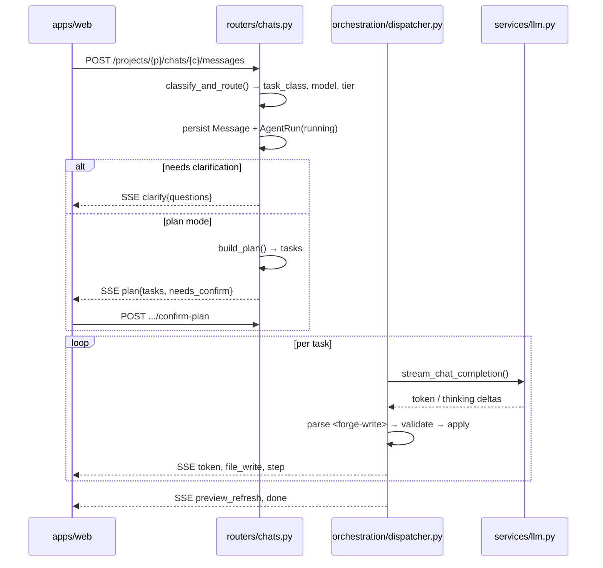

> 🇫🇷 [Version française](ARCHITECTURE.fr.md)

# Architecture

How Forge turns a chat message into a running React app, and where each piece
lives. Written for contributors — every claim below points at a file you can
open.

## The short version

```
apps/web      Next.js 15 App Router — builder UI, SSE consumer
apps/api      FastAPI — routing, agent orchestration, publishing
  runtime/    Node + browser Babel/ESM toolchain (shared by preview AND publish)
data/         templates/ (24 starter kits) · projects/ (generated workspaces)
infra/        local Docker stack · CI helpers · AWS sites gateway
```

Supporting services: **Postgres**, **MinIO** (S3), **Valkey** (Redis), **Caddy**
(serves published sites). LLM calls go out to the RodiumAI gateway.

Three ideas explain most of the design:

1. **No build step, ever.** Generated projects are never compiled server-side.
   The browser transforms them with Babel standalone and loads dependencies from
   a CDN import map. There is no `node_modules`, no Vite dev server.
2. **One manifest, two consumers.** `apps/api/runtime/packages.json` is the
   single source of truth for the import map, the import allowlist, and Monaco
   types. Preview and publish read the *same* file through the *same* resolver.
3. **The API holds no LLM credentials.** For the current path, Forge sends the
   user's OAuth access token plus an API **key id** — the key secret never
   reaches this codebase.

## A generation run, end to end



**Entry points.** The UI posts from `apps/web/app/projects/[id]/page.tsx` and
folds each event through `apps/web/lib/chat-stream.ts` (`reduceStreamEvent`
returns `{state, effects}`; the page performs the effects). The server side is
`apps/api/app/routers/chats.py` (`send_message`), which picks one of four
branches — image, clarify, single-pass, or plan.

**Streaming.** Everything is SSE, wrapped by `with_sse_heartbeats`
(`apps/api/app/services/sse.py`) which emits `: hb <ts>` comments so a quiet run
is not cut by a proxy. Raise `ALB_IDLE_TIMEOUT_SECONDS` (default 600) to match
your load balancer.

**Event contract** — every frame is `data: <json>`:

| `type` | Meaning |
|---|---|
| `user_message` | run id handshake |
| `route` | routing decision (task class, tier) |
| `step`, `plan`, `plan_task` | activity panel and plan checklist |
| `token`, `thinking` | assistant text / reasoning deltas |
| `clarify` | human-in-the-loop gate; releases the composer |
| `file_write`, `file_delete` | an op was applied |
| `preview_refresh` | emitted at task boundaries, not per write |
| `warning` | validator or verify finding |
| `error`, `done` | terminal |

**Reconnects are first class.** A run is produced by a background task, not by
the HTTP handler — closing the tab does not kill it. `GET .../runs/active`
restores HITL state and `GET .../runs/{id}/events?after=N` replays then tails.

**The LLM call** is plain `httpx` against an OpenAI-compatible
`/chat/completions` — there is no vendor SDK. See `apps/api/app/services/llm.py`.

## The agent loop

**Forge does not use function calling.** The model writes XML tags in its normal
output and the server parses them (`apps/api/app/prompts/system.py` defines the
contract, `apps/api/app/services/tags.py` parses it):

```
<forge-write path="src/App.tsx"> …file contents… </forge-write>
<forge-delete path="src/Old.tsx"></forge-delete>
```

A consequence worth knowing: **the agent does not choose which files to read.**
Context assembly is heuristic — `apps/api/app/services/orchestration/context.py`
selects files by relevance, forced paths, and the plan's declared `files`, then
layers the system prompt, `AI_RULES.md`, a locked `DESIGN.md`, file skeletons and
selected bodies. Older history is compacted by an LLM pass.

Phases: classify → optional clarify → plan → execute → verify/repair. Plans of
four or more tasks, and any scaffold, pause for user confirmation.
`apps/api/app/services/orchestration/dispatcher.py` runs tasks sequentially.

**Writes are validated before anything touches disk**
(`apps/api/app/services/apply_writes.py`):

- A **git snapshot** is taken first — each project is its own private repo under
  `data/projects/{id}`, which is what powers history and rollback.
- Imports are checked against the manifest allowlist using **tree-sitter**
  (`services/import_validator.py`), falling back to regex when unavailable.
  Violations: `BUILD_FORBIDDEN_IMPORT`, `BUILD_INVALID_NAMED_EXPORT`.
- `DESIGN.md` and `public/logo.*` are brand-locked and rejected by default.
- CSS is **merged, not replaced**: top-level blocks whose selectors disappeared
  are re-appended, so a partial rewrite cannot silently drop styles.

## Preview

No dev server is ever started. `GET /runner/` renders a shell
(`apps/api/app/services/preview_babel.py`) that injects the import map, the
allowed parent origins, and Babel standalone. The UI then fetches the project's
source bundle and posts `{type:"forge:render", files, entry}` into the iframe.

Inside the iframe (`apps/api/runtime/`):

1. `transform.mjs` — Babel with the React automatic runtime + TypeScript presets.
2. Bare specifiers are checked against the document's own import map → `IMPORT_NOT_IN_MANIFEST`.
   Specifiers are collected with tight regexes (no quotes between `import`/`export`
   and `from`) plus a plausibility filter so Babel output fragments such as
   `/*#__PURE__*/_jsxs` or the word `from` inside a string like `"or start from"`
   are never treated as packages.
3. `topo.mjs` — topological sort, raising `CIRCULAR_DEPENDENCY` with the cycle.
4. `rewrite.mjs` + `resolve.mjs` — each specifier is rewritten to the dependency's already-created `blob:` URL. Resolution is **case-sensitive** and understands `@/` → `src/`.
5. `await import(entryBlobUrl)`. Old blobs are revoked on success, kept on failure so the error stays inspectable.

The import map is not mutable after load, which is why the project's own extra
dependencies must be injected at shell-render time (`?p=<uuid>`). Bump the
`?v=` query on `runner.js` / `bridge.js` in `preview_babel.py` whenever the
runner contract changes, or browsers keep a stale transform.

**During generation the builder hides the blocking Babel overlay**
(`PreviewPane` `suppressErrorOverlay` while `busy || streamActive`). Mid-plan
files are often briefly inconsistent; the overlay returns once the run settles
if the preview is still broken.

**Origin pinning is strict in both directions.** `RUNNER_PARENT_ORIGINS` builds
an allowlist; the runner refuses to send to anything else. The code notes this
was tightened after accepting any localhost port let a rogue local page read app
content.

## Attachments, logos, and URL cloning

Prompt images carry an **intent** (`apps/web/lib/prompt-attachments.ts` +
`apps/api/app/services/attachments.py`):

| Intent | UI label (FR) | Effect |
|---|---|---|
| `reference` | Capture de référence | Vision-only; multi-page plans when ≥2 references |
| `asset` | Asset joint | Materialized under `public/` (logo → `public/logo.*`); the agent must use those paths and must not redraw the logo |

`reference` and `asset` **coexist** on the same message — a screenshot no longer
overwrites a logo.

If the user pastes a public site URL without enough reference shots, the API
captures desktop + mobile screenshots with Playwright
(`apps/api/app/services/url_capture.py`, wired in `routers/chats.py`) and appends
them as `intent:reference` markers before routing. Chromium is installed in the
API image (`playwright install --with-deps chromium`).

## Publishing

`POST /projects/{id}/publish` → `apps/api/app/services/publish_esm.py`:

1. Spawns `node apps/api/runtime/cli.mjs`, piping the project over **stdin**.
2. `cli.mjs` reuses the *same* Babel transform and resolver as the preview, but
   `rewrite.mjs` emits **relative `.js` paths** instead of blob URLs. It writes a
   static `index.html` with the import map inlined, all CSS in one `<style>`
   (`src/index.css` first — matching the preview exactly), and a module script.
3. `public/` is copied verbatim; everything uploads to the object store under
   `{slug}/`.

Caddy is a **pure reverse proxy to the bucket** — no origin app. It maps the
slug out of the Host header and rewrites to the bucket key, with an SPA fallback
to `{slug}/index.html`. See `infra/local/Caddyfile` and
`infra/aws/sites-gateway/Caddyfile`.

`/v1/authorize-host` exists **only for custom domains**: Caddy's `forward_auth`
asks the API whether a hostname maps to a validated `ProjectDomain`, and gets
back the slug to rewrite to. The slug always stays the S3 key — a custom domain
changes routing, never storage.

## Data model

`apps/api/app/models.py`, SQLAlchemy 2.0 on Postgres. The core chain is
`User → Project → Chat → Message`, with `AgentRun` recording each generation
(status, plan, clarify answers, and `cursor_task_index` so a run can resume).
`UserSettings` holds encrypted RodiumAI tokens. `ProjectDomain`, `StoredObject`,
`SiteUsageDay`, `PreviewComment` and `ModelCatalog` round it out.

**There is no Alembic.** `apps/api/app/db.py` runs `create_all()` followed by a
hand-written list of idempotent statements (`ADD COLUMN IF NOT EXISTS`, …), run
from the FastAPI lifespan and from `make migrate`. There is **no rollback path
and no version table** — add schema changes as new idempotent statements, and
expect to handle backfills yourself.

## Authentication

Two independent layers:

- **The Forge session** — an HS256 JWT over `SECRET_KEY`, 7 days, issued by
  `POST /auth/rodium/callback`. `get_current_user` accepts it as a Bearer header
  *or* an `?access_token=` query param, deliberately, so `` loads work.
- **RodiumAI OIDC tokens** — obtained by an authorization-code + PKCE flow
  (`apps/api/app/services/rodium_oidc.py`). The OAuth `state` is itself a signed
  JWT carrying the PKCE verifier, so no server-side session store is needed.
  Access and refresh tokens are stored Fernet-encrypted in `user_settings`.

`resolve_generation_auth` (`services/rodium_generation.py`) runs at the top of
every generation endpoint. In the current path it sends the user's access token
plus an API **key id** — **the key secret never reaches Forge.** A legacy path
decrypts a stored key instead.

> Sign-in requires the RodiumAI OIDC provider, which is **not in this
> repository**. With `RODIUM_OIDC_CLIENT_ID` unset, `/auth/rodium/start` returns
> 503 and there is no local fallback: `/auth/register` is permanently `410 Gone`.

## Background work

**Everything runs in the API process.** `spawn_plan_job` creates an
`asyncio.Task`; the HTTP handler only relays from a buffer. There is no worker
container, and `docker-compose.yml` defines none.

Valkey/Redis is used for the run event log (24h TTL, the durable replay buffer),
a run claim key, and a cancellation flag. **It is optional**: every helper
degrades to an in-process mirror when Redis is unreachable, because a down
Valkey used to produce a silent infinite spinner.

## Rough edges worth knowing

Honest notes for anyone reading the code and wondering:

- `forge:plan:queue` is pushed to but **never popped** — a placeholder for a
  future worker that does not exist yet.
- `providers/keys.py` and `providers/secrets.py` are complete but appear to have
  **no importers**; the encryption actually in use is Fernet in `app/crypto.py`.
  Production config still asserts KMS/Secrets Manager.
- `providers/queue.py` defines a full Redis Streams usage queue that nothing
  publishes to or consumes; `SiteUsageDay` is written synchronously instead.
- `Project.preview_port` / `preview_running` are vestigial from a Vite-dev-server
  era.
- `apps/web/lib/preview-host.ts` rewrites to `/preview-by-slug/{slug}`, for which
  **no FastAPI route exists** — locally Caddy serves those hosts from MinIO. It
  looks like a leftover from the pre-Caddy architecture.

## Where to go next

- [CONTRIBUTING.md](../CONTRIBUTING.md) — setup, checks, PR process
- [TEMPLATES.md](TEMPLATES.md) — the template-kit authoring contract
- [DOCKER.md](../DOCKER.md) — local stack, ports, preview notes
